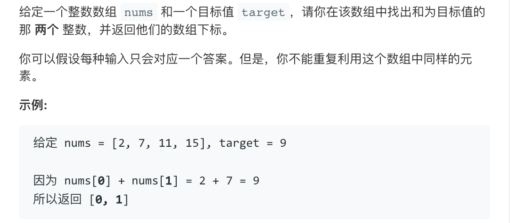

# 1. 两数之和（Two Sum）

## 描述



## 解法分析

### 解法1

求解的关键则是 $k = target - nums[i]$, k 是否在数组 $nums$ 中，且 k 的索引不等于 i。

先将数组 $nums$ 转化为字典 $ref$，其中字典的 key 为数组 $nums$ 存储的数据， 字典的 value 为数据对应在 $nums$ 中的 index。这样只需要遍历字典 $ref$的 key，计算 $searchback = target - some_key$， 并判断 $searchback$ 是否是不等于 some_key 的 key。

空间复杂度： 借用了字典来存储 nums， *O(N)*
平均时间复杂度：*O(N/2)*
最坏时间复杂度： *O(N)* 因为有可能遍历到字典最后两个数据才能得出结果。

```Python
# 1 two sum 两数之和

__author__ = "Yang Xuan (jumpthepig@gmail.com)"


def twoSum(nums, target):

    # Change list into dictionary.
    # dictionary_keys are values of list nums
    # dictionary_value are indexes of list nums
    ref = {value: index for (index, value) in enumerate(nums)}

    for index, value in enumerate(nums):
        searchback = ref.get(target - value, None)
        if searchback and searchback != index:
            return [index, searchback]
        continue


args = ([2, 7, 11, 15], 9)
assert twoSum(*args) == [0, 1]
```
